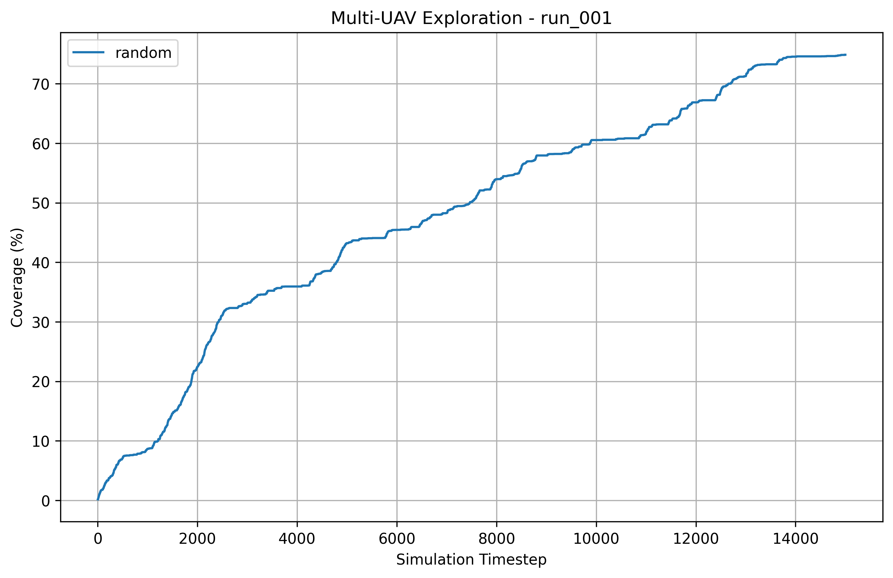

# Project-Muse

**MUSE**: Multi-UAV Swarm Exploration

A research project focused on multi-agent exploration strategies for unmanned aerial vehicles (UAVs). The project implements and compares different coordination algorithms for autonomous drone swarms tasked with exploring unknown environments.

## Overview

The goal of this project is to evaluate how different exploration strategies perform in terms of:
- **Coverage**: How much of the environment is explored over time
- **Efficiency**: Total distance traveled by the drone swarm
- **Coordination**: Minimizing redundant exploration (overlap) between drones

## Project Structure

```
Project-Muse/
├── environment/         # Simulation environment and grid maps
│   ├── simulator.py     # Main simulation engine
│   ├── grid.py          # Occupancy grid implementation
│   ├── planner/         # Path planning utilities (BFS, frontier detection)
│   └── coordination/    # Frontier assignment algorithms
├── agents/              # Drone agent implementations
├── strategy/            # Exploration strategies
│   ├── random_strategy.py           # Random baseline
│   ├── frontier_strategy.py         # Frontier-based exploration
│   ├── coordinated_frontier_strategy.py  # Coordinated frontier approach
│   ├── gso_strategy.py              # GSO (planned)
│   └── ppo_strategy.py              # PPO RL (planned)
├── experiments/         # Experimental scripts
│   ├── run_experiment.py   # Run single experiment
│   ├── run_suite.py        # Run multiple strategies
│   └── analyze_results.py  # Generate plots and analysis
├── metrics/             # Metrics collection and logging
├── results/raw/         # Raw CSV data from experiments
├── plots/               # Generated visualization plots
├── models/              # Data models and constants
└── docs/                # Research notes and documentation
```

## Exploration Strategies

### 1. Random Strategy (`RandomStrategy`)
**Baseline approach** - Each drone randomly selects a valid action (up, down, left, right) at each timestep. This serves as a naive baseline to compare more sophisticated approaches against.

**Characteristics:**
- No coordination between drones
- No memory of visited locations
- Purely stochastic movement

### 2. Frontier Strategy (`FrontierStrategy`)
**Goal-directed exploration** - Drones identify frontiers (boundaries between explored and unexplored regions) and navigate toward them using BFS path planning.

**Variants based on frontier assignment:**
- **Nearest Frontier** (`NearestFrontierAssigner`): Each drone independently selects the closest frontier cell using BFS search
- **Greedy Frontier** (`GreedyFrontierAssigner`): Drones sequentially pick nearest frontiers, removing assigned frontiers to reduce overlap

**Characteristics:**
- Systematic coverage of unknown areas
- Uses BFS for shortest-path navigation
- Can be extended with coordination mechanisms

### 3. Coordinated Frontier Strategy (`CoordinatedFrontierStrategy`)
**Advanced coordination** - Extends the frontier strategy with explicit coordination between drones to minimize redundancy and improve coverage efficiency.

### 4. Future Strategies (Planned)
- **GSO Strategy**: Glowworm Swarm Optimization bio-inspired approach
- **PPO Strategy**: Proximal Policy Optimization reinforcement learning approach

## How Algorithms Are Compared

The comparison framework evaluates each strategy across multiple experimental runs with the following methodology:

### Experimental Setup
- **Grid Size**: 100×100 cells
- **Number of Drones**: 5
- **Obstacle Density**: 10%
- **Communication Radius**: 10 cells
- **Maximum Steps**: 15,000 timesteps
- **Multiple Seeds**: 5 different random seeds (runs 001-005) for statistical validity

### Metrics Tracked
Each experiment records the following metrics at every timestep:

| Metric | Description |
|--------|-------------|
| **Coverage (%)** | Percentage of grid cells explored (FREE or OBSTACLE vs UNEXPLORED) |
| **Total Distance** | Cumulative distance traveled by all drones |
| **Overlap (%)** | Percentage of redundant sensing (cells sensed by multiple drones) |

### Comparison Process

1. **Run Experiments**: Execute `python experiments/run_suite.py` to run all strategies on the same set of map seeds
2. **Collect Data**: Metrics are saved as CSV files in `results/raw/run_XXX/`
3. **Generate Plots**: Execute `python experiments/analyze_results.py` to create visualizations

### Example Plot

The analysis generates coverage curves showing **Coverage (%) vs Simulation Timestep** for each strategy:



*Example: Coverage progression for Run 001 (Seed 1)*

**Interpretation:**
- **X-axis**: Simulation timestep (0 to 15,000)
- **Y-axis**: Coverage percentage (0% to 100%)
- **Each line**: One exploration strategy
- **Steeper curve**: Faster exploration
- **Higher final value**: Better overall coverage

An aggregate plot (`aggregate_coverage.png`) shows mean coverage ± standard deviation across all 5 runs, providing statistical confidence in the comparison.

### Expected Results
- **Random**: Slow, inefficient coverage with high overlap
- **Frontier (Nearest)**: Faster initial coverage but potential clustering
- **Frontier (Greedy)**: Better distribution, reduced overlap
- **Coordinated**: Best balance of speed and efficiency (when implemented)

## Getting Started

### Prerequisites
- Python 3.8+
- Required packages (see `pyproject.toml`):
  - `pandas` - Data manipulation
  - `matplotlib` - Plotting
  - `numpy` - Numerical operations

### Installation

```bash
# Using uv (recommended)
uv sync

# Or using pip
pip install -e .
```

## Usage

### Run a Single Experiment
```bash
python experiments/run_experiment.py
```

### Run Full Test Suite (All Strategies × 5 Seeds)
```bash
python experiments/run_suite.py
```

This will:
1. Create 5 experimental runs with different random seeds
2. Test each strategy on identical map configurations
3. Save raw metrics to `results/raw/run_XXX/`

### Analyze Results & Generate Plots
```bash
python experiments/analyze_results.py
```

This generates:
- Individual coverage plots per run: `plots/run_XXX_coverage.png`
- Aggregate performance plot: `plots/aggregate_coverage.png`

### View Raw Data
```bash
cat results/raw/run_001/random.csv
```

## Configuration

Key parameters can be adjusted in `experiments/run_experiment.py`:

```python
GRID_WIDTH = 100          # Map width in cells
GRID_HEIGHT = 100         # Map height in cells
NUM_DRONES = 5            # Number of drones in swarm
OBSTACLE_PERCENTAGE = 0.10  # 10% obstacles
COMMUNICATION_RADIUS = 10   # Drone communication range
MAX_STEPS = 15000         # Maximum simulation duration
TARGET_COVERAGE = 90.0    # Target coverage percentage
```

## Adding New Strategies

To implement a new exploration algorithm:

1. Create a new file in `strategy/` (e.g., `my_strategy.py`)
2. Inherit from `ExplorationStrategy` base class
3. Implement the `choose_action()` method
4. Optionally override `prepare_step()` for pre-computation
5. Add to `run_suite.py` strategies dictionary

```python
from strategy.exploration_strategy import ExplorationStrategy

class MyStrategy(ExplorationStrategy):
    def __init__(self):
        super().__init__("MyStrategy")
    
    def choose_action(self, agent, robot_map, true_map, nearby_agents):
        # Your algorithm here
        return Action.UP
```

## Research Notes

See `docs/research_notes.md` for detailed algorithmic discussions and theoretical background.

## License

[Add license information here]

## Citation

If you use this project in your research, please cite:

```
@project{muse2024,
  title = {MUSE: Multi-UAV Swarm Exploration},
  year = {2024}
}
```
